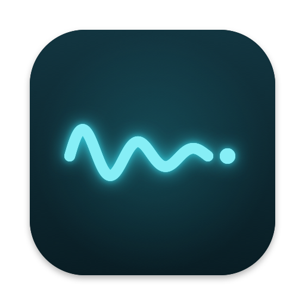
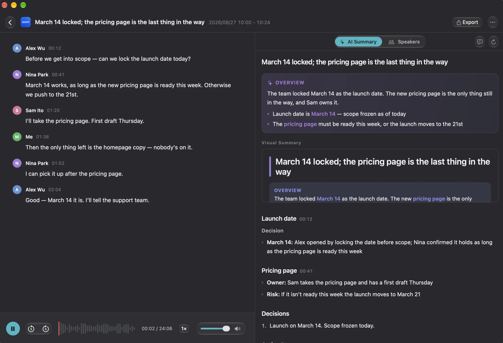

  

  <strong>MeetKeep</strong> 
  When the meeting's over, you're done.

  The meeting notetaker for Apple Silicon Macs. It records, transcribes, and writes down what actually matters — all on your own machine. The audio never leaves.

  <a href="https://meetkeep.app"><strong>meetkeep.app</strong></a>
  ·
  <a href="https://meetkeep.app/changelog/">Changelog</a>
  ·
  <a href="https://github.com/xlsama/meetkeep/issues">Issues</a>
  ·
  <a href="./README.zh-CN.md">中文</a>

---

## Features

* 💻 Native macOS app. Written in Swift. Built for Apple Silicon.
* 🎙️ **Starts itself** — Join a call and recording begins. About ten seconds after the last person leaves, it stops and starts transcribing.
* 🔒 **Runs on your Mac** — Qwen3-ASR for Chinese, Parakeet for English. Word-level timestamps from the audio. Mixed Chinese and English stay intact.
* 📝 **Notes you can use** — Decisions, owners, due dates, open questions. Click any line to hear the original words. One-page visual summary for chat or updates.
* 👥 **Knows who is who** — Separates speakers; enroll a voice once and names carry across meetings.
* 🎛️ Three recording sources: mic / mic + one app / mic + system audio. Import audio and video too.
* 🔍 Full-text search across every meeting. Export to Markdown, TXT, or mixed m4a.
* 🔌 Optional MCP server so Claude Code and Codex can read your meetings (read-only, text-only, off by default).
* 🍎 Requires macOS 15+ and Apple Silicon.

## Works with

Zoom · Microsoft Teams · Google Meet · Slack Huddles · Tencent Meeting · Lark · DingTalk

Transcribes offline · no bot joins your call.

## Privacy

Transcription and speaker ID run on-device. Audio is never uploaded. Aside from these four cases, MeetKeep does not reach the network:

1. License activation, renewal, deactivation
2. Checking for updates
3. Downloading speech models (HuggingFace or a mirror)
4. The AI provider *you* configure — text only, after you approve

No cloud transcription. No bot joins your call. No telemetry.

## Download

* [Download for Mac](https://meetkeep.app)

## Issues

This public repo is for [issues and questions](https://github.com/xlsama/meetkeep/issues). Source lives elsewhere.

Useful context for a bug report:

* MeetKeep version (Settings › General) and macOS version
* What you did, what you expected, what happened
* For transcription or notes: language and roughly how long the meeting was

---

MeetKeep is built for people who sit in too many meetings and still want the notes to be useful. If it saves you a few hours a week, a license keeps the work going ❤️
