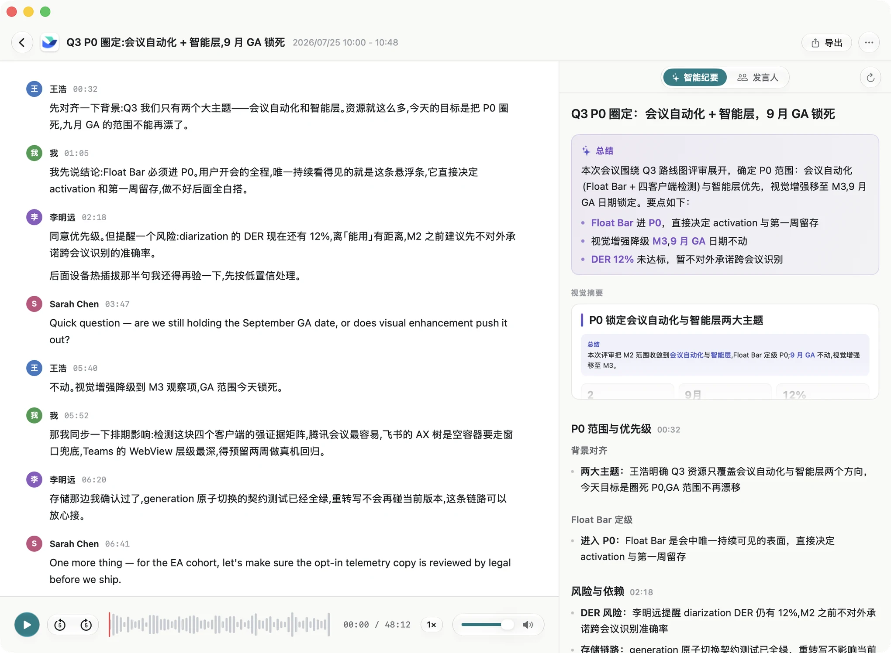

  

  <strong>MeetKeep</strong> 
  开完会，就真的开完了。

  面向 Apple Silicon Mac 的会议记录助手。它自己录、自己转文字、自己把该记的记下来——全程在你这台机器上完成。音频不上传。

  <a href="https://meetkeep.app"><strong>meetkeep.app</strong></a>
  ·
  <a href="https://meetkeep.app/zh/changelog/">更新日志</a>
  ·
  <a href="https://github.com/xlsama/meetkeep/issues">Issues</a>
  ·
  <a href="./README.md">English</a>

---

## 功能

* 💻 原生 macOS 应用，Swift 编写，专为 Apple Silicon 打造。
* 🎙️ **自己会开始** — 你一进会就开录；最后一个人离开约十秒后自动结束并开始转写。
* 🔒 **跑在你的 Mac 上** — 中文 Qwen3-ASR，英文 Parakeet。字级时间戳来自音频本身，中英混说也能保住。
* 📝 **纪要能用** — 只写结论：定了什么、谁负责、什么时候、还有什么没说清。点任意一行，跳回原话。一页可视化摘要，方便贴进更新或聊天。
* 👥 **认得是谁在说** — 分开每一位说话人；录入一次声纹，之后会议里名字会跟过来。
* 🎛️ 三种录音来源：仅麦克风 / 麦克风 + 单个应用 / 麦克风 + 系统音频。也支持导入音视频。
* 🔍 跨会议全文搜索。导出 Markdown、TXT 或混合 m4a。
* 🔌 可选 MCP Server，让 Claude Code、Codex 只读会议文本（默认关闭，纯文本）。
* 🍎 需要 macOS 15+ 与 Apple Silicon。

## 适配

Zoom · Microsoft Teams · Google Meet · Slack Huddles · 腾讯会议 · 飞书 · 钉钉

转写不联网 · 不用拉机器人进会。

## 隐私

转写与说话人识别都在本机完成，音频不会上传。除下面四种情况外，MeetKeep 不会访问网络：

1. 许可证激活、续期、解绑
2. 检查更新
3. 下载语音模型（HuggingFace 或镜像）
4. 你自己配置的 AI 服务 — 仅文本，且需你确认后才会发送

没有云端转写，没有 bot 进会，没有遥测。

## 下载

* [下载 Mac 版](https://meetkeep.app)

## 反馈

本公开仓库用于 [Issues 与提问](https://github.com/xlsama/meetkeep/issues)。源码在别处。

报 bug 时尽量写上：

* MeetKeep 版本（设置 › 通用）与 macOS 版本
* 你做了什么、期望怎样、实际怎样
* 若与转写或纪要有关：语言、会议大概多长

---

MeetKeep 写给那些会太多、却还想纪要真正好用的人。若它每周能省你几小时，一份许可证就是在支持继续做下去 ❤️
